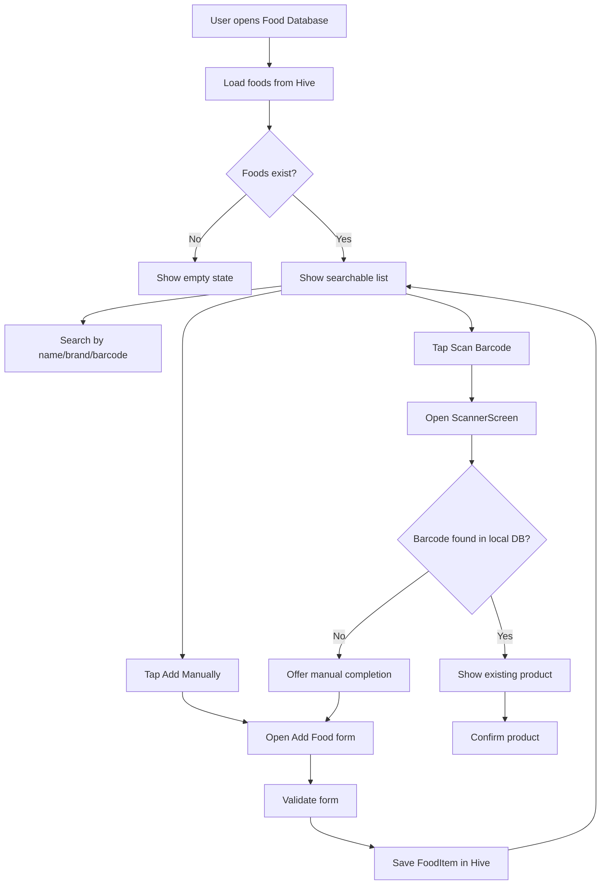
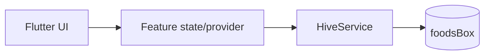
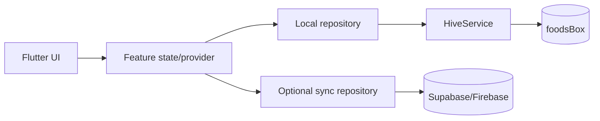

# Food Database Plan

Plano específico para a feature `Food Database`, com foco em:
- fluxo de telas
- estrutura de dados
- papel do `Hive` local
- possibilidade futura de sync com backend

## Checklist de implementacao guiada
Use esta checklist para executar a feature e estudar a arquitetura ao mesmo tempo.

Legenda:
- `[x]` concluido
- `[-]` parcialmente pronto
- `[ ]` pendente

### Bloco A: tela e rota
- [x] criar `FoodDatabaseScreen`
- [x] registrar `AppRoutes.foodDatabase`
- [x] adicionar `case AppRoutes.foodDatabase` no `AppRouter`
- [x] ligar um ponto de entrada visivel para abrir a tela
- [x] validar que a tela abre sem `Route Error`

### Bloco B: leitura local com Hive
- [x] entender `HiveService.foodsBox`
- [x] carregar alimentos reais na tela
- [x] renderizar lista de `FoodItem`
- [x] implementar estado vazio
- [-] validar atualizacao da lista com dados locais

### Bloco C: busca local
- [x] adicionar campo de busca
- [x] filtrar por `name`
- [x] filtrar por `brand`
- [x] filtrar por `barcode`
- [x] validar busca sem depender de backend

### Bloco D: cadastro manual
- [x] criar `AddFoodScreen`
- [x] montar formulario com campos obrigatorios
- [x] validar `name`
- [x] validar `kcalPer100g`
- [x] salvar `FoodItem` no `Hive`
- [x] voltar para a lista com atualizacao visivel

### Bloco E: integracao com Scanner
- [x] botao `Manual Entry` abrir cadastro manual
- [x] botao `Scan Barcode` abrir scanner
- [x] scanner procurar alimento por barcode na base local
- [x] scanner reaproveitar item existente quando encontrado
- [x] scanner oferecer complemento manual quando nao encontrar

### Bloco F: integracao com Plans
- [x] disponibilizar lista de alimentos para `Plans`
- [x] usar `kcalPer100g` no calculo
- [ ] permitir persistir alimento escolhido no plano

### Bloco G: decisao de arquitetura
- [ ] manter `Hive` como fonte de verdade local
- [ ] nao introduzir backend antes do fluxo local fechar
- [ ] documentar claramente quando sync remoto passa a fazer sentido

### Bloco H: modelagem de alimento e receita
- [ ] estender `FoodItem` para suportar `sourceType`
- [ ] definir `sourceType`: `barcode`, `manual`, `homemade`
- [ ] manter `FoodItem` simples para alimento industrializado ou cadastro manual
- [ ] validar campos base do alimento simples:
  - `name`
  - `brand?`
  - `kcalPer100g`
  - `protein?`
  - `fat?`
  - `barcode?`
- [ ] decidir se `homemade` entra primeiro como `FoodItem` manual ou ja como entidade separada
- [ ] desenhar entidade de receita composta:
  - `RecipeItem` ou `HomemadeMeal`
  - lista de ingredientes
  - gramas por ingrediente
  - kcal total
  - kcal por 100g
- [ ] definir fluxo de cadastro de receita caseira
- [ ] definir como `Plans` vai consumir alimento simples vs receita

## Decisão de arquitetura
Implementar `Food Database` como `offline-first` com `Hive` local.

Motivos:
- o projeto já possui `HiveService` e `FoodItem`
- o scanner ainda está em fase inicial e precisa de persistência simples
- `Plans` e `Daily` precisam consumir alimentos locais antes de qualquer sync
- adicionar `Firebase` ou `Supabase` agora aumentaria complexidade sem destravar o fluxo principal

Decisão prática:
- agora: banco local com `Hive`
- depois: camada opcional de sincronização remota

## Modelo atual de dados
Arquivo base: [food_item.dart](/run/media/mateus/f8271cf2-fe57-43a3-a203-4b4c407bd599/CatDiet/cat_diet_planner/lib/data/models/food_item.dart)

Campos atuais:
- `barcode`
- `name`
- `brand`
- `kcalPer100g`
- `protein`
- `fat`

Isso já é suficiente para o primeiro fluxo operacional.

## Evolucao planejada do modelo
### Nivel 1: alimento simples
Um `FoodItem` deve poder representar:
- alimento industrializado
- alimento manual

Campos alvo para este nivel:
- `name`
- `brand?`
- `kcalPer100g`
- `protein?`
- `fat?`
- `barcode?`
- `sourceType`: `barcode`, `manual`, `homemade`

Decisao pragmatica:
- fechar primeiro o suporte a alimento simples
- manter `FoodItem` como unidade minima de consumo em `Plans`

### Nivel 2: receita
Depois, evoluir para receita composta, por exemplo comida caseira.

Modelo previsto:
- `RecipeItem` ou `HomemadeMeal`
- composto por varios ingredientes
- cada ingrediente com peso em gramas
- calculo do total da receita
- derivacao de `kcalPer100g`

Exemplo:
- frango 200g
- abobora 100g
- azeite 5g
- total da receita
- kcal total
- kcal por 100g

Recomendacao:
- nao tentar resolver receita composta antes de fechar o fluxo local de alimento simples
- quando entrar receita, tratar como entidade propria em vez de improvisar tudo dentro de um unico `FoodItem`

## Escopo da feature
### Fase 1: rota e tela real
Objetivo:
tirar `Food Database` do estado inexistente.

Entregáveis:
- `FoodDatabaseScreen`
- rota `AppRoutes.foodDatabase`
- entrada pela navegação interna
- UI com:
  - barra de busca
  - atalho `Scan Barcode`
  - atalho `Add Manually`
  - lista de alimentos

Critério de aceite:
- usuário consegue abrir a tela
- a tela já tem estrutura final navegável

### Fase 2: leitura local via Hive
Objetivo:
fazer a lista refletir dados persistidos.

Entregáveis:
- leitura de `HiveService.foodsBox`
- exibição da lista real
- filtro por:
  - nome
  - marca
  - barcode
- estado vazio quando não houver itens

Critério de aceite:
- a lista muda conforme os dados locais
- busca funciona sem mock

### Fase 3: cadastro manual
Objetivo:
fechar o primeiro fluxo útil de fato.

Entregáveis:
- `AddFoodScreen` ou modal dedicado
- formulário com:
  - `name`
  - `brand`
  - `kcalPer100g`
  - `barcode` opcional
  - `protein` opcional
  - `fat` opcional
- validação mínima
- salvar no `Hive`

Critério de aceite:
- usuário consegue adicionar um alimento
- item aparece imediatamente na `Food Database`

### Fase 4: integração com Scanner
Objetivo:
fazer o scanner deixar de ser só visual.

Entregáveis:
- botão `Manual Entry` abre cadastro manual
- botão `Confirm Product` salva ou confirma alimento
- `Scan Barcode` navega para `ScannerScreen`
- scanner tenta localizar por barcode na base local antes de criar novo item

Critério de aceite:
- scanner reaproveita dados locais
- fluxo manual e scanner convergem para a mesma base

### Fase 5: integração com Plans
Objetivo:
fazer alimentos cadastrados virarem insumo do produto.

Entregáveis:
- `Plans` consegue listar/select `FoodItem`
- cálculo usa `kcalPer100g`
- alimento escolhido pode ser persistido como parte do plano

Critério de aceite:
- o alimento salvo na base já serve para o plano alimentar

## Estrutura recomendada
Arquivos mínimos:
- `lib/features/food_database/screens/food_database_screen.dart`
- `lib/features/food_database/screens/add_food_screen.dart`

Arquivos prováveis depois:
- `lib/features/food_database/providers/food_database_provider.dart`
- `lib/features/food_database/widgets/...`

Abordagem recomendada:
- começar simples, com tela + provider leve
- só depois extrair widgets se a tela crescer demais

## Fluxo funcional

## Visão de dados
### Agora: local only

Leitura:
- a UI fala com a camada de estado
- a camada de estado fala com `HiveService`
- `foodsBox` é a fonte de verdade local

### Futuro: local first com sync remoto

Leitura:
- `Hive` continua sendo a fonte imediata para a UI
- backend entra depois como sincronização, não como dependência obrigatória da tela

## Backend: quando entra e quando nao entra
### Agora
Nao usar backend.

Razoes:
- a feature ainda precisa fechar fluxo local
- sem fluxo local pronto, backend so mascara problemas de produto
- o app foi desenhado para `offline-first`

### Depois
Backend passa a fazer sentido quando existirem:
- cadastro real de perfis
- alimentos persistidos localmente
- weight history persistido
- plans reais
- necessidade de backup/sync entre dispositivos

## Se no futuro houver backend
### Supabase
Melhor encaixe provavel se a necessidade for:
- sync relacional
- auth simples
- Postgres
- storage de assets

### Firebase
Melhor encaixe se a prioridade for:
- ecossistema Google
- notificacoes e analytics integrados
- stack mais orientada a documentos/eventos

Decisao recomendada para este projeto:
- continuar local agora
- avaliar `Supabase` depois para backup e sync

## Ordem de implementacao recomendada
1. `FoodDatabaseScreen`
2. rota `AppRoutes.foodDatabase`
3. listagem local via `foodsBox`
4. busca local
5. `AddFoodScreen`
6. salvar no `Hive`
7. integrar `ScannerScreen`
8. integrar `Plans`

## Criterio de pronto por etapa
### Etapa A
Tela abre e navega corretamente.

### Etapa B
Lista e busca usam dados reais do `Hive`.

### Etapa C
Cadastro manual cria `FoodItem` persistido.

### Etapa D
Scanner e `Food Database` compartilham a mesma base.

### Etapa E
`Plans` consome alimentos da base.

## Riscos reais
- acoplamento prematuro entre scanner e banco antes da listagem estar pronta
- criar formulario manual sem validacao de `kcalPer100g`
- deixar a fonte de verdade ambigua entre mock e `Hive`
- tentar colocar backend antes de fechar o fluxo local

## Proxima execucao recomendada
Implementar primeiro:
- `FoodDatabaseScreen`
- rota nomeada
- listagem vinda de `HiveService.foodsBox`

Nao implementar ainda:
- sync remoto
- auth
- camera real
- busca remota
